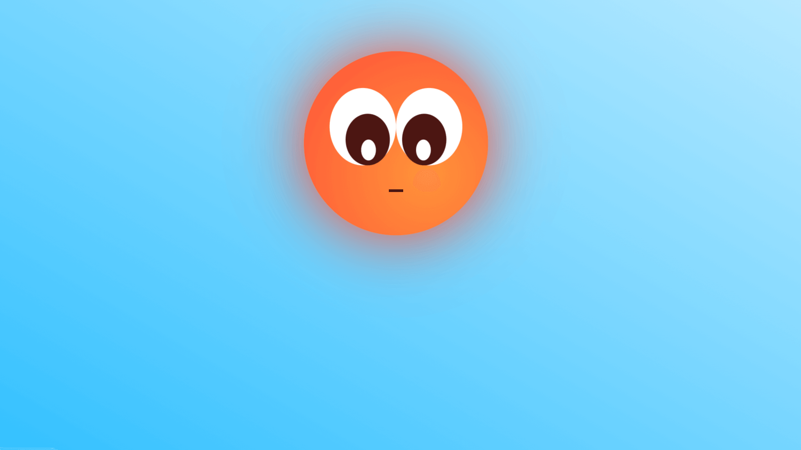

# La Liga de Creatividad de Platzi

Este proyecto es un cómic animado en HTML y CSS desarrollado por la estudiante [Nancy Gomes](https://platzi.com/p/nancygtec/), participante del reto de La Liga de Creatividad de Platzi.  

Fue implementado a la par de tomar clases enfocadas en creación de historias y personajes y animaciones, transiciones y transformaciones con CSS.

Toda la información del reto [aquí](https://platzi.com/blog/liga-creatividad-platzi/).

## Información técnica

El proyecto fue construido con HTML5 y CSS3\. Comprende un directorio de estilos, uno de imágenes uno de recursos y el index.html que es la página principal.
La historia se presenta en cuatro escenas organizadas estilo carrusel con avance automático.

Para disfrutar plenamente de la experiencia se requiere lo siguiente:

*   Conexión a internet para visualizar todos los recursos.
*   Pantalla con resolución mínima de 1280x720 (por los momentos no es responsive).
*   Navegador Google Chrome.
*   Ganas de conocer al mejor Superhéroe de todos los tiempos.

Si deseas ver el proyecto en funcionamiento puedes entrar a: [https://nancygtec.github.io/the-sun-maker/](https://nancygtec.github.io/the-sun-maker/)

## El personaje

### Nombre
The Sun Maker

### Mundo
El espacio sideral. Actualmente se encuentra en Tormentalandia.

### Superpoderes
Puede volar, tiene supervelocidad, pero su poder más importante es la supersonrisa.

### Misión
Enseñarle a los habitantes de Tormentalandia que una simple sonrisa puede ser la mejor arma para luchar en contra de la oscuridad.

### Motivación
Conocer de cerca a los habitantes de cada planeta para poder aprender de ellos y llevarles directamente su luz.

### Objetivo
Que cada lugar por el que pase se vuelva más alegre y empático de lo que era antes de su visita.

### Personalidad
Es alegre, curioso y bonachón, también un poco torpe. Es muy empático y siempre está dispuesto a ayudar. Su grito de guerra es “¡Iiiiiiipaaaaa!.

### Características
Es una estrella joven (de aproximadamente 500 millones de años). Tiene unos grandes ojos llenos de ingenuidad que inspiran ternura. Su boca parece pequeña hasta que nos muestra su gran sonrisa.

### Historia de vida
The Sun Maker es uno de los hijos más jóvenes del Sol, algún día en el futuro será la principal fuente de luz y calor de toda una galaxia, pero antes ha emprendido un largo viaje lleno de aventuras que le harán crecer como estrella y tener amigos por todo el espacio.
